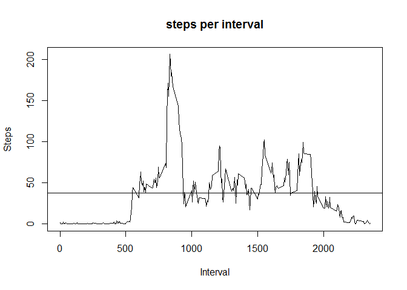

# Reproducible Research: Peer Assessment 1
Joe Fuqua  

## Loading and preprocessing the data

First step is to read the data file (note that the file is a compressed zip file, so the appropriate method for loading the data should be used).


```r
stepdata <- read.table(unz("activity.zip", "activity.csv"), sep=",", header=TRUE)
```

Let's take a look at the structure of the data:


```r
str(stepdata)
```

```
## 'data.frame':	17568 obs. of  3 variables:
##  $ steps   : int  NA NA NA NA NA NA NA NA NA NA ...
##  $ date    : Factor w/ 61 levels "2012-10-01","2012-10-02",..: 1 1 1 1 1 1 1 1 1 1 ...
##  $ interval: int  0 5 10 15 20 25 30 35 40 45 ...
```
We can see that there are several missing values in the 'steps' column, which we will need to address.  Let's check the total NA for 'steps' and the other columns:


```r
sum(is.na(stepdata$steps))
```

```
## [1] 2304
```

```r
sum(is.na(stepdata$date))
```

```
## [1] 0
```

```r
sum(is.na(stepdata$interval))
```

```
## [1] 0
```

Looks like the other columns are fully populated.

Let's remove the rows with NA's.  Also, the 'date' column is not DATE format, so we can recast the type of the column.


```r
stepdata$date<-as.Date(stepdata$date)
cleandata<-stepdata[!is.na(stepdata$steps),]
```


## What is mean total number of steps taken per day?

We will use the 'cleandata' data set for this calculation.  First, let's aggregate the data by day and produce a visual, with a line drawn for the mean.


```r
daily<-aggregate(cleandata$steps, by=list(cleandata$date), FUN='sum')
colnames(daily) <- c('Date','steps')

hist(daily$steps, xlab="Date",ylab="Steps",main='steps per day')

dailymean<-mean(daily$steps)
dailymed<-median(daily$steps)
abline(v=dailymean)
```

 

```r
print(dailymean)
```

```
## [1] 10766.19
```

```r
print(dailymed)
```

```
## [1] 10765
```

That's almost 11,000 steps per day on average.

## What is the average daily activity pattern?

Let's now look at average daily activity.  We'll calculate the mean steps per interval and plot.


```r
intraday<-aggregate(cleandata$steps, by=list(cleandata$interval), FUN='mean')
colnames(intraday) <- c('interval','steps')

plot(intraday$interval ,intraday$steps, xlab="Interval",ylab="Steps",main='steps per interval', type='l')

intradailymean<-mean(intraday$steps)
abline(h=intradailymean)
```

 

The interval with the highest average is:

```r
maxintave<-max(intraday$steps)
maxint<-intraday[intraday$steps==maxintave,]

print(maxint)
```

```
##     interval    steps
## 104      835 206.1698
```


## Imputing missing values

We can fill in missing values of the original data set to estimate a more complete view of activity for the period in question.  There are multiple options for estimating missing values, one of which is to replace the missing values of a given interval with the mean for that interval.

First, let's see how many values we need to replace:


```r
imputedata<-stepdata
sum(is.na(imputedata$steps))
```

```
## [1] 2304
```

Now let's perform the replacement: 


```r
for(i in 1:nrow(imputedata)) {
  
  if (is.na(imputedata[i,1])) {
    imputedata[i,1]<-intraday[which(intraday[,1]==imputedata[i,3]),2]
  }
}
```

Let's compare the orignal plot to the newly imputed dataset


```r
par(mfrow=c(1,2))
imp_daily<-aggregate(imputedata$steps, by=list(imputedata$date), FUN='sum')
colnames(imp_daily) <- c('Date','steps')

hist(daily$steps, xlab="Date",ylab="Steps",main='steps per day', breaks = 20)
abline(v=dailymean)

hist(imp_daily$steps, xlab="Date",ylab="Steps",main='steps per day', breaks=20)

imp_dailymean<-mean(daily$steps)
imp_dailymed<-median(daily$steps)
abline(v=imp_dailymean)
```

 

Visually, there is little difference.  Looking at the mean and median values:


```r
print(dailymean)
```

```
## [1] 10766.19
```

```r
print(dailymed)
```

```
## [1] 10765
```

```r
print(imp_dailymean)
```

```
## [1] 10766.19
```

```r
print(imp_dailymed)
```

```
## [1] 10765
```

So no significant difference in medians and means for the two datasets.  Given the method for imputing missing values, this is not surprising.

## Are there differences in activity patterns between weekdays and weekends?

Now we can compare weekend activity to weekday activity.  First, we need to create a new column to differentiate weekdays from weekends:


```r
library(chron)

imp_wkwe<-imputedata

imp_wkwe$daytype<-'weekday'
imp_wkwe[is.weekend(imp_wkwe[,2]),4]<-'weekend'
imp_wkwe$daytype<-as.factor(imp_wkwe$daytype)
```

Now plot the results

```r
par(mfrow=c(2,1))

imp_wk<-subset(imp_wkwe, daytype=='weekday')
imp_we<-subset(imp_wkwe, daytype=='weekend')

iwk_ag<-aggregate(imp_wk$steps, by=list(imp_wk$interval), FUN='mean')
colnames(iwk_ag) <- c('interval','steps')
iwe_ag<-aggregate(imp_we$steps, by=list(imp_we$interval), FUN='mean')
colnames(iwe_ag) <- c('interval','steps')

plot(iwk_ag$interval ,iwk_ag$steps, xlab="Interval",ylab="Steps",main='weekday steps per interval', type='l')
plot(iwe_ag$interval ,iwe_ag$steps, xlab="Interval",ylab="Steps",main='weekend steps per interval', type='l')
```

 

So steps taken during the weekends show a higer degree of variability than the number taken during weekdays.

